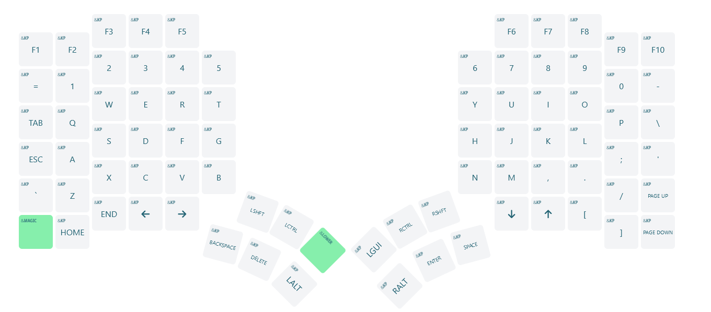
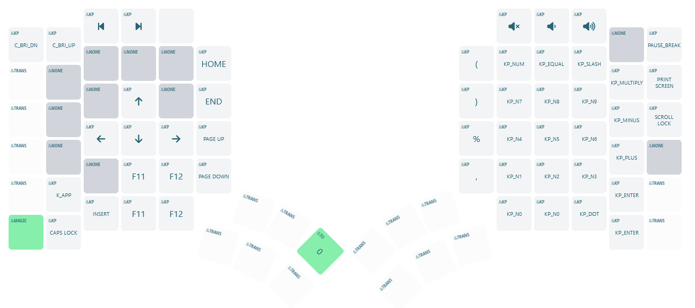
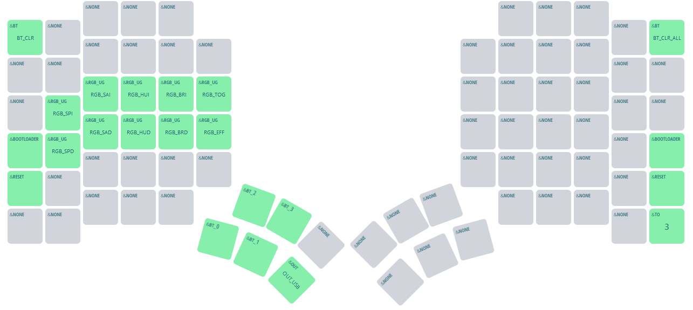

# Glove80 Custom Configuration for ZMK

Small changes to the default Moergo config, just swapping the right hand arrow keys (up/down) so that they're in the same order as VIM movements.

## Base Layer

---
## Lower Layer

---
## Magic Layer

## Firmware Files
To locate your firmware files and reflash your Glove80...
1. Click "Actions" in the main navigation, and in the left navigation click the "Build" link.
2. Select the desired workflow run in the centre area of the page (based on date and time of the build you wish to use). You can also start a new build from this page by clicking the "Run workflow" button.
3. After clicking the desired workflow run, you should be presented with a section at the bottom of the page called "Artifacts". This section contains the results of your build, in a file called "glove80.uf2"
4. Download the glove80.uf2
5. Flash the firmware to Glove80 according to the user documentation on the official Glove80 Glove80 Support website (linked below)

Your keyboard is now ready to use.

## Resources
- The [official MoErgo Glove80 Support](https://moergo.com/glove80-support) web site. Glove80 documentation and other technical resources.
- The [official MoErgo Discord Server](https://moergo.com/discord). Instant conversations with other Glove80 users.

- The [official ZMK Documentation](https://zmk.dev/docs) web site. Find the answers to many of your questions about ZMK Firmware.
